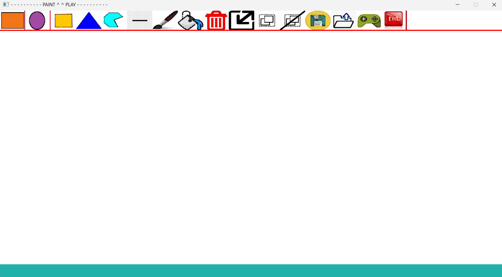
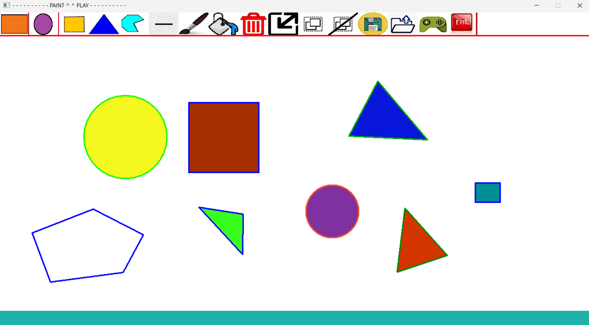
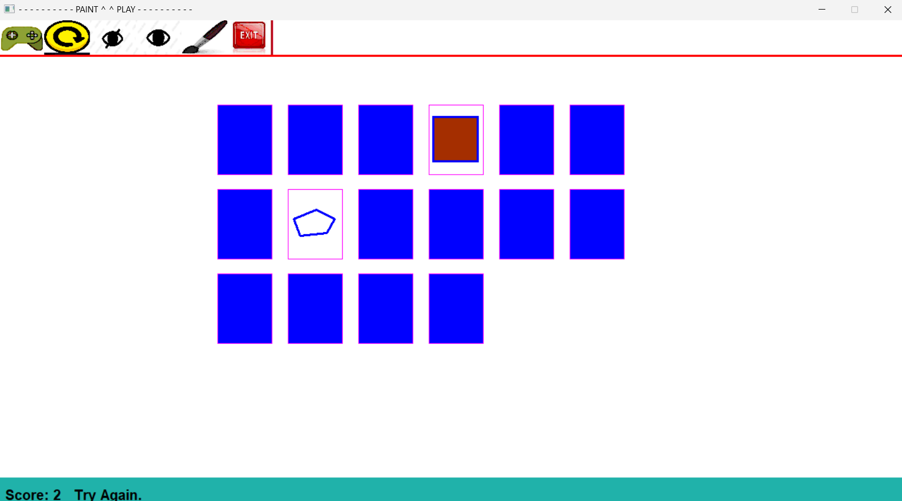

# Paint & Play - Interactive Drawing & Matching Game

<div align="center">
  
  
  <p align="center">
    A C++ desktop application that combines creative drawing tools with an engaging memory-matching game. Built with object-oriented design principles and a custom GUI framework.
  </p>
</div>

## 🎨 About The Project

<div align="center">
  
</div>

Paint & Play is a dual-mode application that offers both creative and entertainment features:

- **Draw Mode**: A full-featured drawing application where users can create and manipulate various shapes
- **Play Mode**: A memory-matching game that uses the shapes drawn by the user

The project demonstrates advanced C++ concepts including polymorphism, inheritance, design patterns, and file I/O operations.

## ✨ Features

### Draw Mode Features

<div align="center">
  
</div>

- **Shape Creation**
  - Rectangle
  - Square
  - Circle
  - Triangle
  - Line
  - Irregular Polygon

- **Shape Manipulation**
  - Select single or multiple shapes
  - Move shapes by dragging
  - Resize shapes (by scale factor or dragging)
  - Rotate shapes
  - Copy/Paste shapes
  - Duplicate shapes
  - Delete shapes

- **Styling**
  - Change draw color
  - Change fill color
  - Adjust border width
  - Fill/unfill shapes

- **Advanced Operations**
  - Group/Ungroup shapes
  - Save drawings to file
  - Load drawings from file
  - Undo/Redo operations

### Play Mode Features

<div align="center">
  
</div>

- **Memory Matching Game**
  - Automatic card generation from drawn shapes
  - Scrambled card positions
  - Score tracking
  - Hide/Unhide cards
  - Restart game functionality

## 🚀 Getting Started

### Prerequisites

- Microsoft Visual Studio (2017 or later)
- Windows OS
- C++11 or higher

### Installation

1. Clone the repository
```bash
git clone https://github.com/yourusername/paint-and-play.git
```

2. Open the solution file
```
CIE202-project.sln
```

3. Build the project in Visual Studio
   - Select Build → Build Solution (or press Ctrl+Shift+B)

4. Run the application
   - Press F5 or click Start Debugging

## 📖 Usage

### Draw Mode

<div align="center">
  
</div>

1. **Creating Shapes**
   - Click on any shape icon in the toolbar
   - Click on the canvas to define the shape's points
   - Follow the status bar instructions for each shape type

2. **Selecting Shapes**
   - Left-click on a shape to select it (deselects others)
   - Right-click on a shape to add it to selection
   - Selected shapes appear highlighted

3. **Moving Shapes**
   - Press 'M' or 'm' key
   - Click and drag selected shapes to new positions
   - Press ESC to exit move mode

4. **Resizing Shapes**
   - By scale: Click resize icon, enter scale factor (0.25, 0.5, 2, or 4)
   - By dragging: Press 'R' or 'r', drag corner points, press ESC to finish

5. **Keyboard Shortcuts**
   - `M/m`: Move mode
   - `R/r`: Resize by drag mode
   - `D/d`: Duplicate selected shapes
   - `S/s`: Scramble all shapes
   - `Ctrl+C`: Copy selected shapes
   - `Ctrl+V`: Paste copied shapes
   - `ESC`: Exit current mode

6. **Saving/Loading**
   - Click Save icon, enter filename
   - Click Load icon, enter filename to load
   - Files are saved as `.txt` format

### Play Mode

<div align="center">
  
</div>

1. Click "Play" icon to switch to Play Mode
2. Click "Start Game" to generate cards from your drawings
3. Click two cards to match them
4. Score increases by 3 for correct matches, 1 for incorrect attempts
5. Match all pairs to win
6. Use "Restart" to shuffle and start over

## 📁 Project Structure
```
CIE_202_Team03_Project/
├── GUI/                        # User interface components
│   ├── GUI.cpp
│   └── GUI.h
├── operations/                 # Operation classes (Command pattern)
│   ├── opAddRect.cpp/h
│   ├── opAddCircle.cpp/h
│   ├── opAddSquare.cpp/h
│   ├── opAddTriangle.cpp/h
│   ├── opAddLine.cpp/h
│   ├── opAddIrregularPolygon.cpp/h
│   ├── opSelect.cpp/h
│   ├── opMove.cpp/h
│   ├── opResize.cpp/h
│   ├── opDelete.cpp/h
│   ├── opCopy.cpp/h
│   ├── opPaste.cpp/h
│   ├── opGroupShapes.cpp/h
│   ├── opUnGroupShapes.cpp/h
│   ├── opSave.cpp/h
│   ├── opLoad.cpp/h
│   ├── opStartGame.cpp/h
│   ├── opMatchShapes.cpp/h
│   └── operation.h
├── Shapes/                     # Shape classes (Strategy pattern)
│   ├── Shape.cpp/h            # Abstract base class
│   ├── Rect.cpp/h
│   ├── Square.cpp/h
│   ├── Circle.cpp/h
│   ├── Triangle.cpp/h
│   ├── Line.cpp/h
│   ├── IrregularPolygon.cpp/h
│   ├── Group.cpp/h
│   ├── Card.cpp/h
│   └── Graph.cpp/h            # Manages all shapes
├── images/MenuIcons/           # UI icons
├── controller.cpp/h            # Main controller (MVC pattern)
├── main.cpp                    # Entry point
└── DEFS.h                     # Global definitions
```

## 🏗️ Class Diagram

<div align="center">
  
</div>

The project follows object-oriented design principles with clear separation of concerns:

- **Controller**: Manages application flow and coordinates between GUI and Graph
- **GUI**: Handles all user interface operations
- **Graph**: Maintains collection of shapes and game state
- **Shape Hierarchy**: Base class with derived classes for each shape type
- **Operation Hierarchy**: Command pattern for all user operations
- **Card**: Encapsulates shape for memory game

## 🛠️ Built With

- **Language**: C++
- **IDE**: Microsoft Visual Studio
- **Graphics Library**: CMUgraphics (Custom graphics library)
- **Design Patterns**: 
  - MVC (Model-View-Controller)
  - Command Pattern
  - Factory Pattern
  - Composite Pattern

## 🤝 Contributing

Contributions are welcome! Please feel free to submit a Pull Request.

1. Fork the Project
2. Create your Feature Branch (`git checkout -b feature/AmazingFeature`)
3. Commit your Changes (`git commit -m 'Add some AmazingFeature'`)
4. Push to the Branch (`git push origin feature/AmazingFeature`)
5. Open a Pull Request

## 🙏 Acknowledgments

- CMUgraphics library for providing the graphics framework

<!-- CONTACT -->
<!-- END CONTACT -->

